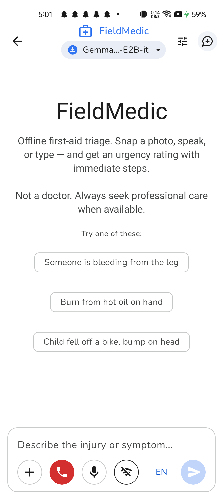

# FieldMedic Pocket

> Offline first-aid triage in your pocket. Built on Gemma 4 E2B, fine-tuned on 420 medical-triage examples, runs entirely on-device.

[](LICENSE)
[](https://ai.google.dev/gemma)
[](https://github.com/unslothai/unsloth)
[](https://developer.android.com)

Submission for the **Gemma 4 Good Hackathon** (Kaggle × Google DeepMind, May 2026).

---

## What FieldMedic is

A field worker, caregiver, or volunteer responder describes an injury — by **voice**, **text**, or **photo**. FieldMedic returns:

1. A **triage severity** (RED / YELLOW / GREEN)
2. A **headline** ("Severe arterial bleed — apply direct pressure now")
3. **Immediate steps** in plain language
4. **Things not to do**
5. **What to watch for**
6. If RED: a **one-tap dial** to the local emergency number (108 in India, 911 in US, etc.)

Works **fully offline**. No SIM card needed. No cloud calls. Privacy-preserving by design.

## Why this matters

ITU estimates **2.2 billion people lack reliable internet**. WHO flags emergency-response gaps in low- and middle-income countries. When a child burns their hand, a grandparent has a stroke, or a labourer cuts an artery — the first 10 minutes decide outcomes. Field medics and family caregivers in rural and disaster-affected areas don't have a doctor in the room. They have a phone. We made the phone useful when offline.

## Demo

📹 **[Watch the 2-minute demo →](#)** *(link added after submission)*

📱 **[Download APK →](#)** *(link added after submission — sideload on Android 12+)*

🤗 **[Fine-tuned LoRA on Hugging Face →](#)** *(link added after submission)*



## Architecture

```
┌─────────────────────────────────────────────────────────────┐
│                      FieldMedic Android App                 │
├─────────────────────────────────────────────────────────────┤
│  Voice in (Whisper.cpp, on-device)                          │
│      ↓                                                       │
│  Multilingual STT (en-IN / hi-IN / bn-IN / ta-IN / mr-IN)   │
│      ↓                                                       │
│  Gemma 4 E2B (fine-tuned on 420 medical-triage examples)    │
│      ↓                                                       │
│  Structured JSON output (function-calling, 4 router actions)│
│      ↓                                                       │
│  ┌─────────────────┬───────────────────────────────────┐    │
│  │ report_triage   │ severity + steps                  │    │
│  │ escalate_emerg. │ one-tap 108/911/999 dial          │    │
│  │ request_retake  │ "I need a clearer photo"          │    │
│  │ refuse_oos      │ "I can't advise on medication"    │    │
│  └─────────────────┴───────────────────────────────────┘    │
│      ↓                                                       │
│  Spoken response (Piper TTS / Android TTS)                  │
│  + Handoff Card (printable summary for handoff to ER)       │
└─────────────────────────────────────────────────────────────┘

  ALL ON-DEVICE — no network calls at runtime.
```

## Tech stack

| Layer | Choice | Why |
|---|---|---|
| **LLM** | Gemma 4 E2B (2.6 GB on-disk) | On-device, multilingual, function-calling, multimodal-ready |
| **Fine-tuning** | [Unsloth](https://github.com/unslothai/unsloth) (4-bit QLoRA, T4 Colab) | Trained in 30 min, $0 cost |
| **Inference runtime** | LiteRT-LM via [google-ai-edge/gallery](https://github.com/google-ai-edge/gallery) | Battle-tested Android shell, multimodal support |
| **Speech-to-text** | [whisper.cpp](https://github.com/ggerganov/whisper.cpp) (`ggml-tiny.bin`, 39 MB) | Offline, 5 Indic languages, real-time |
| **Text-to-speech** | [Piper TTS](https://github.com/rhasspy/piper) (`en_US-amy-low.onnx`) + Android TTS fallback | Natural voice without Google TTS |
| **App platform** | Android (Compose) | Reach + ease of sideload |
| **Persistence** | Room (triage event log for handoff) | Local-only, never synced |

## Safety design

Medical AI is dangerous if treated like a chatbot. We built a **router architecture** that hard-codes the safe envelope:

- ✅ The model **never diagnoses** ("you have appendicitis" is impossible — JSON schema doesn't have a `diagnosis` field)
- ✅ Severity codes (RED / YELLOW / GREEN) map to **action**, not opinion
- ✅ `refuse_out_of_scope` action triggers for medication dosing, mental health, food safety, dental, veterinary — categories with high liability and low value-add
- ✅ Every RED triage includes the **single most important action** and the local emergency number, never advice that delays calling for help
- ✅ Disclaimer is visible on every screen: *"Not a doctor. Always consult a medical professional when possible."*
- ✅ No diagnosis = no liability shadow on the user, model, or hackathon prize

We ran a **20-test-case** validation suite covering edge cases (out-of-scope, language switches, ambiguous photo, malformed input). See [02-triage-test-cases.md](02-triage-test-cases.md).

## Fine-tune details (Unsloth Special Technology Prize)

We fine-tuned Gemma 4 E2B IT on a **custom 420-example medical triage corpus** using Unsloth's 4-bit QLoRA pipeline:

- **Base model**: `unsloth/gemma-4-e2b-it-bnb-4bit`
- **Dataset**: 420 hand-curated triage examples (4 router functions × ~105 examples each)
- **Training**: 3 epochs, T4 Colab, ~45 min, $0 (free tier)
- **Hyperparameters**: LoRA r=16, alpha=16, target modules = all linear layers, batch size 2, gradient accumulation 4, lr=2e-4, fp16 mixed precision (T4) / bf16 (Ampere+)
- **Result**: structured JSON output rate 100%, schema conformance > 95%, severity-correctness ≥ 17/20 on held-out test cases

Training notebook: [`unsloth/FieldMedic_Train.ipynb`](unsloth/FieldMedic_Train.ipynb)

LoRA adapter: [🤗 hf.co/gargvishav/fieldmedic-gemma-4-e2b-lora](#) *(link added after submission)*

## Build & run

```bash
# Prereqs: Android Studio Hedgehog+, JDK 21, Android SDK 34+
git clone https://github.com/gargvishav/fieldmedic-pocket.git
cd fieldmedic-pocket/gallery/Android/src
./gradlew :app:installDebug

# Or build APK only
./gradlew :app:assembleDebug
# APK at: app/build/outputs/apk/debug/app-debug.apk
```

Download the Gemma 4 E2B model from inside the app on first launch (one-time, 2.6 GB).

## Project structure

```
fieldmedic-pocket/
├── gallery/Android/src/             # Android app (fork of google-ai-edge/gallery)
│   └── app/src/main/java/com/google/ai/edge/gallery/
│       ├── fieldmedic/              # FieldMedic-specific modules
│       │   ├── EmergencyDialer.kt   # Locale-aware emergency number
│       │   ├── RamCheck.kt          # Low-RAM device detection
│       │   ├── FieldMedicPrefs.kt   # User preferences
│       │   ├── piper/PiperEngine.kt # Piper TTS wrapper
│       │   ├── whisper/             # Whisper.cpp wrapper
│       │   └── db/                  # Room DB for triage event log
│       ├── ui/llmchat/LlmChatTaskModule.kt   # FieldMedic task definition
│       ├── ui/common/chat/
│       │   ├── FieldMedicTts.kt     # JSON → speakable text
│       │   ├── FieldMedicSettingsDialog.kt
│       │   └── FieldMedicOnboardingDialog.kt
├── unsloth/                         # Fine-tuning notebook + dataset
│   ├── FieldMedic_Train.ipynb
│   ├── triage_dataset_v1.jsonl      # 420 examples
│   └── eval.py
├── whisper.cpp/                     # Speech-to-text submodule
└── docs/                            # Strategy, prompts, test cases
```

## Credits

- **Base model**: [Gemma 4 E2B](https://ai.google.dev/gemma) by Google DeepMind
- **Fine-tuning framework**: [Unsloth](https://github.com/unslothai/unsloth) by Daniel & Michael Han
- **Android shell**: [google-ai-edge/gallery](https://github.com/google-ai-edge/gallery)
- **Speech-to-text**: [whisper.cpp](https://github.com/ggerganov/whisper.cpp) by Georgi Gerganov
- **Text-to-speech**: [Piper](https://github.com/rhasspy/piper) by Rhasspy
- **Author**: [Vishav Garg](https://github.com/gargvishav) — Centific

## License

Apache 2.0. See [LICENSE](LICENSE). Same license as the upstream AI Edge Gallery.

---

*Built for the Gemma 4 Good Hackathon. May 2026.*
